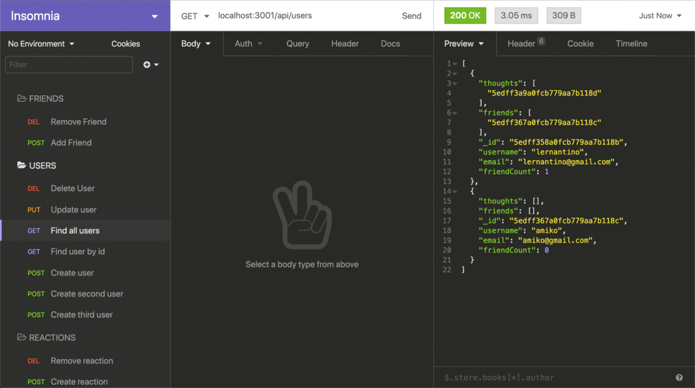
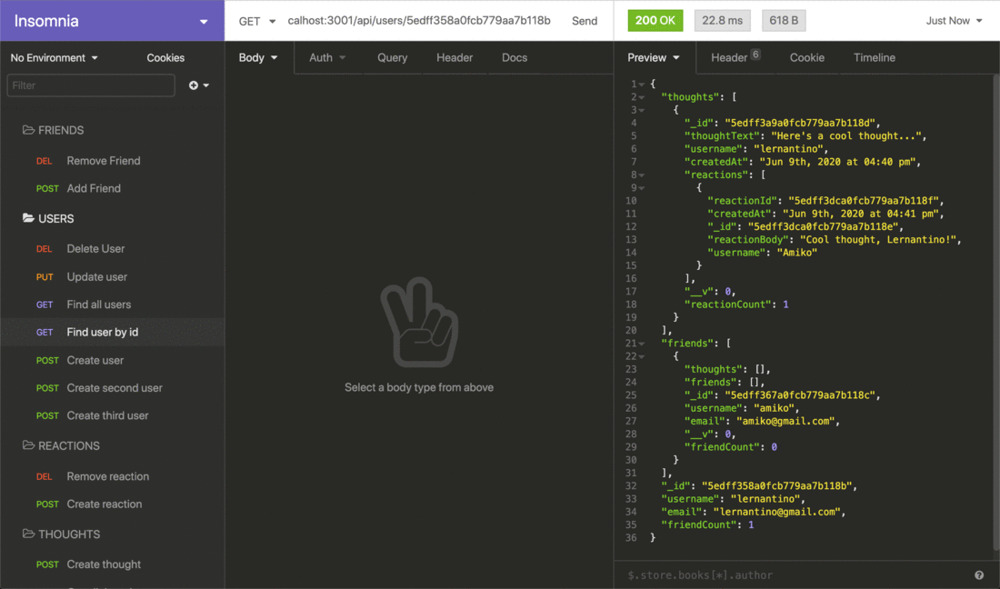
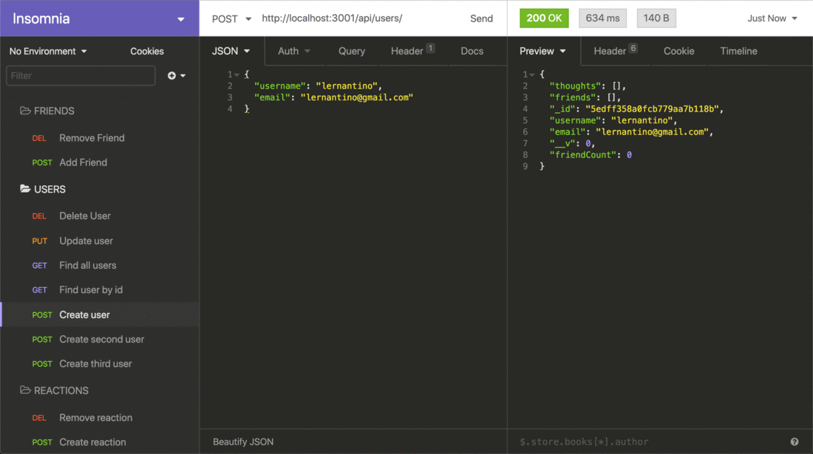
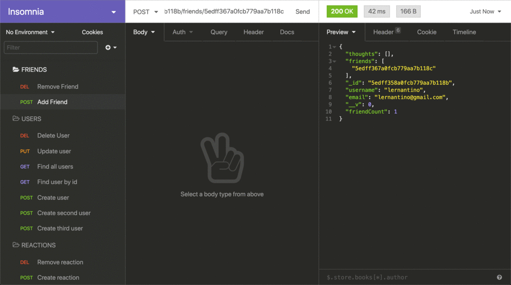

# SocialNetworkAPI

User Story
AS A social media startup
I WANT an API for my social network that uses a NoSQL database
SO THAT my website can handle large amounts of unstructured data

Acceptance Criteria
GIVEN a social network API
WHEN I enter the command to invoke the application
THEN my server is started and the Mongoose models are synced to the MongoDB database
WHEN I open API GET routes in Insomnia for users and thoughts
THEN the data for each of these routes is displayed in a formatted JSON
WHEN I test API POST, PUT, and DELETE routes in Insomnia
THEN I am able to successfully create, update, and delete users and thoughts in my database
WHEN I test API POST and DELETE routes in Insomnia
THEN I am able to successfully create and delete reactions to thoughts and add and remove friends to a user's friend list

Github repo:
https://github.com/Lindseyt75/SocialNetworkAPI.git

Install
Once cloned
Do npm install
Then insure ypu have Mongo DB installed and configured.
Once that is done do npm run start and that will start your server on port 3001.
Then you are ready and here are your routes.

User Routes
GET /api/users (This will get all users)
POST /api/users (This will create a new user)
GET /api/users/:userId (This will get a single user by their ID)
PUT /api/users/:userId (You can update a user by their ID)
DELETE /api/users/:userId (You can also delete a user by their ID)
POST /api/users/:userId/friends (You can add a friend to the user's friend list)
DELETE /api/users/:userId/friends/:friendId (You can also remove a user's friend from the list)

Thought Routes
GET /api/thoughts (This will get all thoughts)
POST /api/thoughts (This will get a single thought by their ID)
GET /api/thoughts/:thoughtId (This will create a new thought)
PUT /api/thoughts/:thoughtId (You can update a thought by their ID)
DELETE /api/thoughts/:thoughtId(You can also delete a thought by their ID)
POST /api/thoughts/:thoughtId/reactions (You can add a reaction to a thought)
DELETE /api/thoughts/:thoughtId/reactions/:reactionId (You can also remove a reaction from a thought)

Insomnia Screenshots

